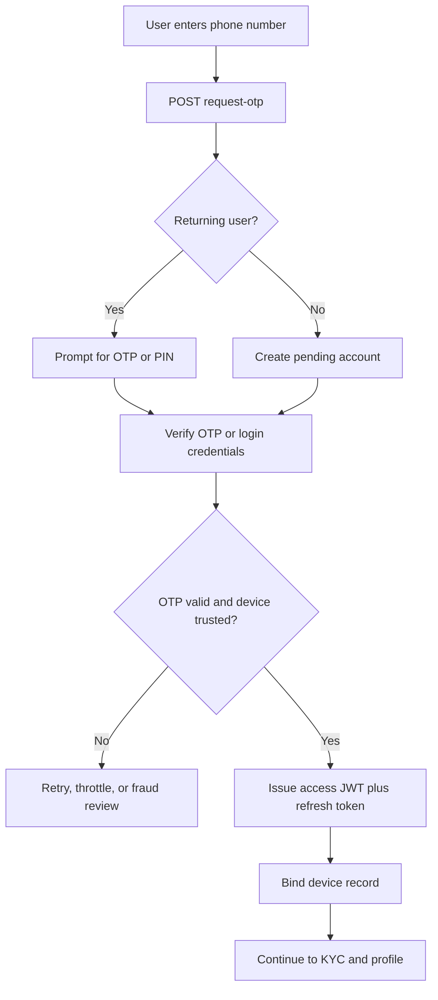
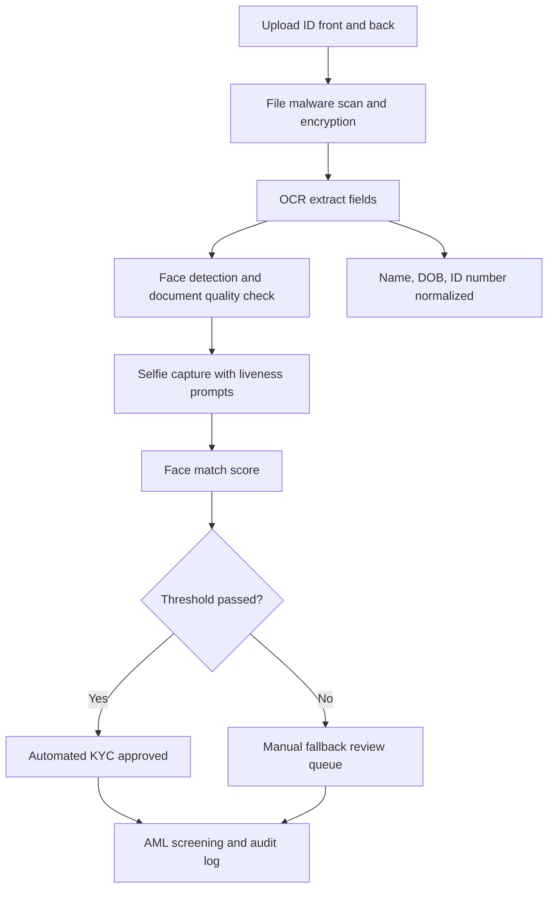

# Quick Loan Backend Architecture

This starter is designed for a mobile-first digital lender operating in Uganda and similar African markets. It supports fast onboarding, strong fraud controls, auditable KYC, and low-latency scoring decisions.

## Recommended service boundaries

Start as a modular Node.js monolith and split by domain as volume grows:

```text
Client apps
  -> API Gateway / BFF
    -> Identity service
    -> KYC service
    -> Consent service
    -> Profile service
    -> Scoring service
    -> Loan origination service
    -> Notification service
    -> Audit and compliance service
```

## Express starter structure

```text
server/
  package.json
  src/
    app.js
    server.js
    config/
      env.js
    middleware/
      auditContext.js
      authenticate.js
      deviceBinding.js
      errors.js
    routes/
      index.js
      auth.routes.js
      consent.routes.js
      kyc.routes.js
      loans.routes.js
      profile.routes.js
      sessions.routes.js
      scoring.routes.js
    websocket/
      verification.socket.js
```

## REST API structure

### Auth and registration

| Method | Route | Purpose |
| --- | --- | --- |
| `POST` | `/api/auth/register/request-otp` | Start SMS OTP challenge, detect returning user, issue challenge ID |
| `POST` | `/api/auth/register/verify-otp` | Verify OTP, bind device, create JWT session |
| `POST` | `/api/auth/login` | Login with phone and PIN/password |
| `POST` | `/api/auth/biometric/assertion` | Login using device biometrics via secure challenge |
| `POST` | `/api/auth/logout` | Revoke refresh token and close session |

### Sessions and devices

| Method | Route | Purpose |
| --- | --- | --- |
| `GET` | `/api/sessions/current` | Fetch current session state and device trust |
| `POST` | `/api/sessions/refresh` | Rotate JWT access and refresh tokens |
| `GET` | `/api/sessions/devices` | List bound devices and fraud flags |

### KYC and identity

| Method | Route | Purpose |
| --- | --- | --- |
| `POST` | `/api/kyc/documents` | Upload ID front/back or passport page |
| `POST` | `/api/kyc/selfie` | Submit selfie and liveness frames |
| `POST` | `/api/kyc/ocr-extract` | Extract name, DOB, and ID number |
| `GET` | `/api/kyc/status` | Return automated result or manual review state |

### Profile and linked accounts

| Method | Route | Purpose |
| --- | --- | --- |
| `GET` | `/api/profile` | Fetch personal and employment profile |
| `PUT` | `/api/profile` | Upsert borrower personal and income data |
| `POST` | `/api/profile/mobile-money` | Link MTN Mobile Money or Airtel Money |
| `POST` | `/api/profile/bank-accounts` | Link optional bank account |

### Consent and credit scoring

| Method | Route | Purpose |
| --- | --- | --- |
| `GET` | `/api/consents` | Fetch current opt-in and opt-out preferences |
| `PUT` | `/api/consents` | Update explicit consent records with timestamps |
| `POST` | `/api/scoring/evaluate` | Run or enqueue AI scoring pipeline |
| `GET` | `/api/scoring/summary` | Return score, eligibility, limit, rate, and drivers |

### Loan offers

| Method | Route | Purpose |
| --- | --- | --- |
| `GET` | `/api/loans/offers` | Get active offer set for current borrower |
| `POST` | `/api/loans/offers/:offerId/accept` | Accept offer and trigger disbursement workflow |

## WebSocket events

Use WebSockets to reduce onboarding friction for event-based updates:

| Event | Direction | Payload |
| --- | --- | --- |
| `otp.subscribed` | server -> client | Challenge subscription confirmed |
| `otp.status` | server -> client | `queued`, `sent`, `delivered`, `failed`, `expired` |
| `kyc.status` | server -> client | `documents_received`, `liveness_passed`, `ocr_complete`, `manual_review`, `verified` |
| `score.ready` | server -> client | Latest score summary and offer metadata |

## Security controls

- JWT access tokens with short TTL plus rotating refresh tokens
- Device binding using a trusted device record and signed fingerprint hash
- End-to-end TLS for all external traffic and encrypted object storage for KYC assets
- Audit log emission on every auth, KYC, consent, scoring, and disbursement action
- Rate limiting and OTP throttling per phone, device, and IP
- Role-based manual review queue for compliance operators
- AML watchlist screening before offer acceptance and disbursement

## Authentication flow



## KYC processing pipeline



## Scaling notes

- Keep the initial Express app modular so each route can move into its own service without changing client contracts.
- Store binary KYC assets in object storage and only keep metadata and hashes in PostgreSQL.
- Use a job queue for OCR, liveness, and scoring so UI requests stay under 2 seconds.
- Publish audit and scoring events to Kafka, RabbitMQ, or a cloud queue once throughput increases.
